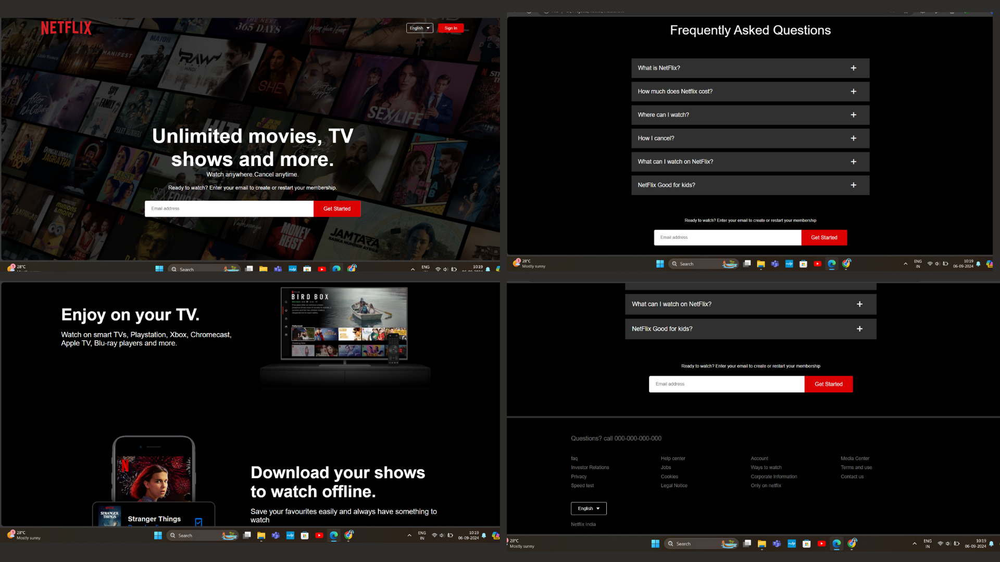

# Netflix Clone

A Netflix homepage clone built using HTML, CSS, and optionally JavaScript. This project replicates the visual design of Netflix's homepage for educational purposes.

## Demo

## Features

- **Responsive design**: Optimized for desktop and mobile devices.
- **Modern UI**: Designed to resemble the Netflix homepage with a focus on layout and styling.
- **Custom Carousel (Optional)**: A functional carousel that auto-scrolls through featured content using JavaScript.

## Technologies Used

- **HTML5**: Structure and layout of the page.
- **CSS3**: Styling and layout design.
